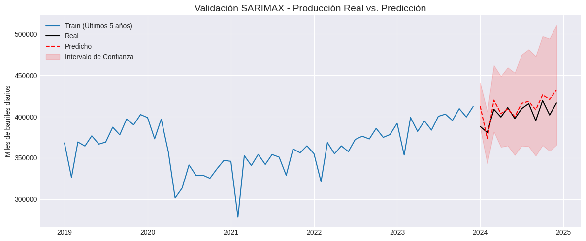

# Forecast de Producción de Crudo (SARIMAX) y Valorización de Riesgo

Este repositorio contiene un análisis predictivo de series temporales enfocado en la producción mensual de petróleo crudo en Estados Unidos. Luego se traduce el error de pronóstico a impacto financiero directo (USD), brindando una herramienta cuantificable para la toma de decisiones, planificación logística y cobertura de riesgos (hedging).

## Resumen Ejecutivo

El script automatiza la extracción de datos históricos desde la API de la Energy Information Administration (EIA). Se entrena un modelo SARIMAX utilizando el precio spot del crudo WTI como variable exógena y se evalúa su desempeño en un período out-of-sample de 12 meses. El desvío estadístico se convierte a volumen físico y se valoriza para entender la exposición al riesgo en la presupuestación.

## Metodología

1. **Ingesta de Datos:** Conexión vía API a las bases de la EIA para obtener series históricas (2000-presente) de producción (MCRFPUS1) y precio WTI (RWTC).
2. **Preprocesamiento:** Alineación temporal, interpolación de valores faltantes y transformación logarítmica para estabilizar la varianza.
3. **Análisis Estadístico:** Evaluación de estacionariedad mediante la prueba de Dickey-Fuller Aumentada (ADF) y análisis de autocorrelación (ACF/PACF).
4. **Modelado Predictivo:** Ajuste de un modelo SARIMAX con optimización de hiperparámetros.
5. **Impacto de Negocio:** Conversión de métricas de error (RMSE/MAPE) a barriles totales y cálculo del desvío financiero mensual.

## Resultados y Visualización

El análisis reporta las métricas de precisión y proyecta el crecimiento de la incertidumbre a lo largo del horizonte predictivo, un factor fundamental para la evaluación de riesgo a largo plazo.

## Estructura del Repositorio

- `notebooks/`: Contiene la Jupyter Notebook principal (`forecast_produccion.ipynb`) con todo el pipeline de datos, modelado y cálculos.
- `images/`: Gráficos exportados del análisis de series temporales.
- `requirements.txt`: Dependencias exactas del proyecto.
- `.env.example`: Plantilla para la configuración segura de credenciales de API.

## Reproducibilidad

Para correr el proyecto en un entorno local es necesario solicitar una API KEY gratuita a EIA OpenData
